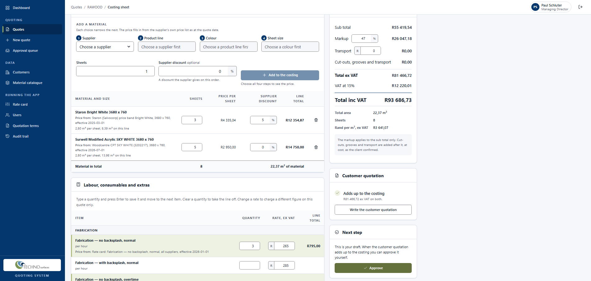
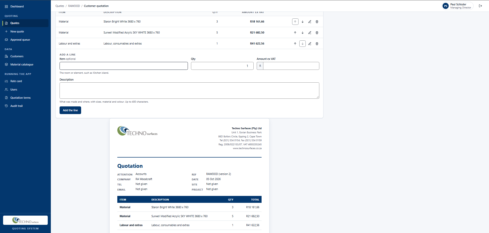
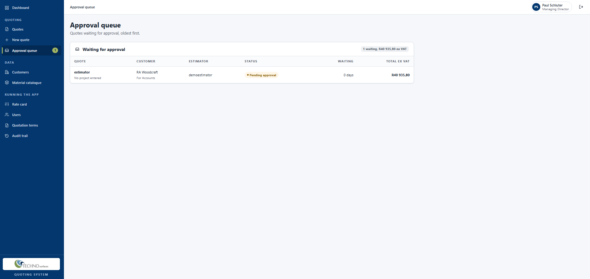
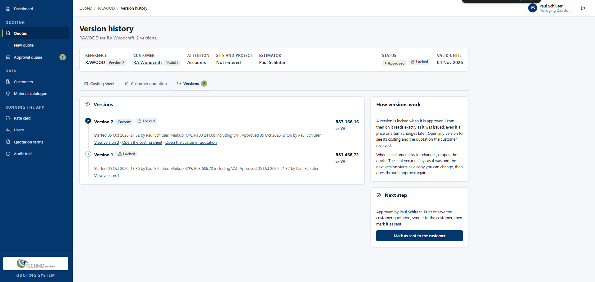
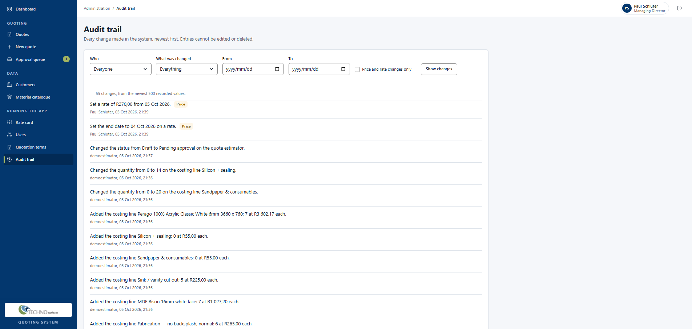
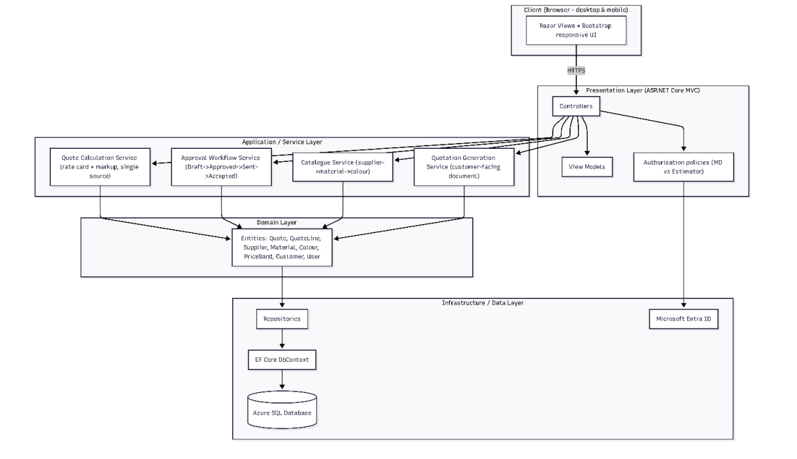
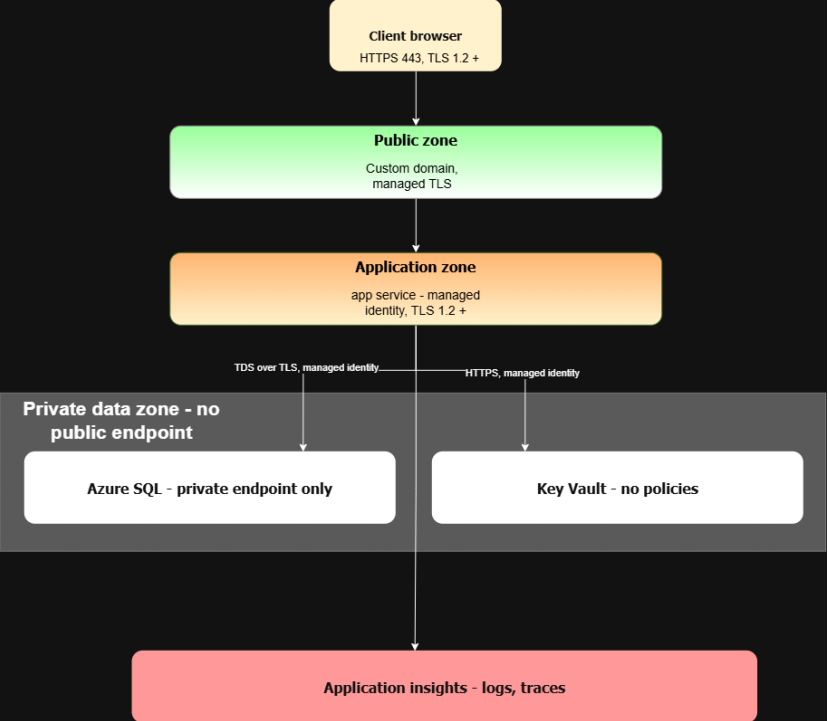

# Techno Surfaces Quoting System

INSY7315 Work Integrated Learning, Task 2. Team CatalystDev.

Techno Surfaces (Pty) Ltd fabricates solid-surface countertops in Cape Town for homeowners, national brands such as Bootleggers and Vida e Caffè, and airports around South Africa. They hold no stock, so every quote is a commitment to buy material. Until now each quote was priced by hand in one Excel costing sheet, with prices looked up in five printed supplier price lists and typed in. A mistyped price (R630 instead of R6 300) or a lookup that quietly returns the wrong figure goes unnoticed until the job loses money.

This web application replaces that sheet. The estimator picks a material by supplier, product line, colour and sheet size, and the price fills in from a single catalogue together with where it came from. A price that cannot be found is refused with a reason, never filled in as zero. The costing calculates itself, the customer quotation is written from it without any cost figures on it, and the Managing Director approves every estimator's quote before it goes out. Quotes keep the prices they were made with, every revision is kept as its own version, and every change to a price or a quote is recorded.

| | |
|---|---|
| Production | https://tsqa-app-production.azurewebsites.net |
| Staging | https://tsqa-app-staging.azurewebsites.net |
| Health check | `/health` on either address |
| Presentation | TO ADD: link to the slides or the recorded video |

## Contents

1. [Signing in to the live system](#signing-in-to-the-live-system)
2. [What the system does](#what-the-system-does)
3. [Screenshots](#screenshots)
4. [Architecture](#architecture)
5. [Data model and database](#data-model-and-database)
6. [The pricing calculation](#the-pricing-calculation)
7. [API](#api)
8. [Security](#security)
9. [Hosting on Azure](#hosting-on-azure)
10. [Branching, CI and CD](#branching-ci-and-cd)
11. [Tests](#tests)
12. [Front end, accessibility and responsive design](#front-end-accessibility-and-responsive-design)
13. [Running it locally](#running-it-locally)
14. [Running costs](#running-costs)
15. [What changed from Task 1](#what-changed-from-task-1)
16. [Known gaps and the plan for Task 3](#known-gaps-and-the-plan-for-task-3)
17. [Team](#team)

## Signing in to the live system

There is no public sign-up. Accounts are created by the Managing Director, which is how the client asked for it to work.


| Role | Email | Password |
|---|---|---|
| Managing Director | demomanager@gmail.com | DemoManager1 |
| Estimator | demoestimator@gmail.com | DemoEstimator1 |

A good path through the system for a first look:

1. Sign in as the estimator and start a new quote for RA Woodcraft.
2. On the costing sheet, choose a supplier, product line, colour and sheet size. The price appears with its source. Enter labour and consumables on the rate card grid below.
3. Open the customer quotation, add the lines from the costing sheet, and submit the quote for approval.
4. Sign in as the Managing Director, open the approval queue, change something on the costing, and approve. The estimator can see the change under "Changes to this quote".
5. Mark the quote as sent, reopen it as if the customer asked for a better price, change it, and open the version history. Version 1 still reads exactly as it was sent.

## What the system does

Two roles use the system: the Managing Director (one person) and estimators (one to three people).

| | Managing Director | Estimator |
|---|---|---|
| Create quotes | Yes | Yes |
| Own quote needs approval | No | Yes |
| Approve quotes | Yes | No |
| Change a quote | Any quote | Own drafts only |
| See every price, including cost prices | Yes | Yes |
| Change prices, rates and the catalogue | Yes | No |
| Manage user accounts | Yes | No |
| See the audit trail | Yes | No |

Estimators seeing cost prices is deliberate. The client confirmed that an estimator cannot judge a quote without knowing what the material costs.

There is no "rejected" status. When the Managing Director is unhappy with an estimator's quote they correct it and approve it themselves, which is how the business already works. Because of that, the audit trail is the only way an estimator finds out their figures were changed, so it is shown on the quote itself.

A quote moves through Draft, Pending approval, Approved, Sent and Accepted. A Draft or Sent quote expires when its validity period runs out (30 days by default, from the client's standing terms). A sent, accepted or expired quote can be reopened, which starts a new version as a copy of the last one and leaves the earlier one locked.

### Screens

All twenty screens from the Task 1 journey maps are built, plus a few the build needed:

- Getting in: sign in, forgotten password, activate account, set your password
- Quoting: dashboard, quote list, new quote, costing sheet, customer quotation, approval queue, review quote, version history, one version in full, invoice record
- Data: material catalogue, price history and price editor, suppliers, one supplier with its product lines, sizes, bands and colours, customers, customer detail
- Running the app: rate card, users, quotation terms, audit trail

Six screens are for the Managing Director only and do not appear in an estimator's menu. An estimator who opens one by its address gets a read-only view, or for users and the audit trail a page saying who it is for, rather than an error page, as the Task 1 journey map specified.

### User stories

Every user story from Task 1 section 2.3 has been built except where noted under [Known gaps](#known-gaps-and-the-plan-for-task-3).

| Story | Delivered by |
|---|---|
| US-01, US-02 | Supplier, product line, colour and sheet size choice on the costing sheet, with the sheet's size and area beside the price |
| US-03 | An unresolved price is refused with the reason (HTTP 422) and the line is not added |
| US-04, US-06, US-07, US-08, US-09 | Costing sheet: quantities, per-quote rate overrides, markup, supplier discount, total m² |
| US-05 | Sandpaper and silicon worked out from the material; see Known gaps for transport |
| US-10, US-11 | Customer quotation built from the costing, with no cost, discount or markup on it, and approval refused until it adds up to the costing |
| US-12, US-13 | Standing terms and warranty by brand, maintained on the quotation terms screen and recorded on each approved version |
| US-14, US-15 | Site, project, customer reference, customer and contact on every quote |
| US-16, US-17, US-18 | Submit, approval queue, correct and approve in one step |
| US-19 | "Changes to this quote" on the costing sheet and review screen, and the audit trail |
| US-20, US-21, US-22 | Reopen as a new version; every version can be opened in full; prices are copied onto each line when it is made |
| US-23, US-24 | Catalogue and rate card maintained by the Managing Director only; materials are retired, never deleted |
| US-25 | Sage Pastel invoice number, date and amount recorded against an accepted quote |
| US-26, US-27 | Accounts created by the Managing Director; nothing but the sign-in pages is reachable without signing in |
| US-28 | Works in a browser on a laptop, tablet or phone |

## Screenshots


| | |
|---|---|
| Costing sheet |  |
| Customer quotation |  |
| Approval queue |  |
| Version history |  |
| Audit trail |  |

## Architecture

ASP.NET Core MVC on .NET 10, Entity Framework Core 10 and Azure SQL. The solution has four projects, each depending only on the ones below it, so the domain knows nothing about the database or the web:

| Project | Holds |
|---|---|
| `TechnoSurfaces.Domain` | Entities, enumerations and the rules that belong to them: the quote lifecycle, version sealing, line totals |
| `TechnoSurfaces.Application` | Services and the interfaces they need: price resolution, the calculation, costing, quote workflow, customer quotation, customers, invoices |
| `TechnoSurfaces.Infrastructure` | EF Core `DbContext`, configurations, migrations, seed data, repositories and queries, the audit interceptor |
| `TechnoSurfacesApp` | MVC controllers and Razor views, the `/api` controllers, ASP.NET Core Identity, authorisation policies, platform settings |



the system architecture diagram (Task 1 Figure 14) as `docs/images/architecture.png`.

Two design patterns from Task 1 section 7.1 are in the code:

- **Strategy, for price resolution.** Three suppliers price by colour band and two price each colour on its own. `IPriceResolutionStrategy` has two implementations, `BandPricedStrategy` and `ItemPricedStrategy`, and `PriceResolver` picks one from the supplier. Adding a supplier with a new pricing scheme means adding a strategy, not editing the resolver.
- **Memento, for quote versions.** A `QuoteVersion` is a snapshot of the quote's contents. It is sealed when approved, and reopening the quote starts a new version as a copy (`QuoteVersion.CreateRevision`), so an earlier version can never be changed.

## Data model and database

The database is Azure SQL, reached through EF Core code-first migrations. The main entities are Supplier, ProductLine, SheetSize, PriceBand, Colour, MaterialPrice, RateItem, RatePrice, Brand, Customer, Contact, AppUser, Quote, QuoteVersion, CostingLine, QuotationLine, QuotationTerm, InvoiceRecord and AuditEntry. Credentials are kept separately by ASP.NET Core Identity in their own `auth` schema.

The rules that matter to the business are enforced by the database itself, not only by the code:

| Rule | How |
|---|---|
| A price belongs to a colour or to a band, never both | Check constraint `CK_MaterialPrice_ColourOrBand` |
| A costing line is a material line or a rate line | Check constraint `CK_CostingLine_MaterialOrRate` |
| No price, rate or line is ever zero | Check constraints `CK_MaterialPrice_Positive`, `CK_RatePrice_Positive`, `CK_CostingLine_PricePositive`, `CK_CostingLine_OverridePositive` |
| Two prices for the same thing are never in force on the same day | Filtered unique indexes for the open price, and triggers `TR_MaterialPrices_NoOverlap` and `TR_RatePrices_NoOverlap` for closed periods |
| Audit entries cannot be changed or deleted | Trigger `TR_AuditEntries_InsertOnly` |
| Nothing in the catalogue or on a quote is deleted by a cascade | Every relationship between the business tables is `NoAction`; catalogue items are retired by status |
| One reference per quote, one number per version | Unique indexes on `Quote.Reference` and `QuoteVersion (QuoteId, VersionNo)` |
| Fast price lookup and approval queue | Indexes on `MaterialPrice (ColourId, SheetSizeId, EffectiveFrom)` and `Quote (Status, IssueDate)` |

Money is `decimal(18,2)` and percentages `decimal(5,2)` throughout; nothing uses floating point.

The catalogue is seeded from the five suppliers' own price lists, about 135 entries. The rate card is seeded from the client's costing workbook, and the standing terms from their quotation template. The bank details are not seeded, because the repository is public; the Managing Director enters them on the quotation terms screen.

the ERD (Task 1 Figure 11) as `docs/images/erd.png`, updated for the entities added since Task 1.

## The pricing calculation

The order of operations was confirmed by the client:

```
effective unit price = unit price x (1 - supplier discount %)
line total           = effective unit price x quantity
sub total            = sum of line totals above the line
markup               = sub total x markup %
below the line       = cut-outs, grooves and petrol/delivery, at cost
total ex VAT         = sub total + markup + below the line
VAT                  = total ex VAT x 15%
```

Sandpaper and consumables take their quantity from the total square metres of material, and silicon and sealing from the number of sheets, two per sheet. Both are shown as calculated and can be typed over. Overtime is the normal fabrication rate times 1.5 and installation mirrors fabrication; both are held as rules on the rate card, not as separate figures.

When a line is added its price is copied onto it, so a later price change does not move a quote that already exists. The price screen for each material lists the quotes that used it and the price each one kept.

## API

The costing sheet and the quote screens talk to these endpoints. Every error comes back as RFC 9457 problem details with the right status code: 201 with a Location header when something is created, 400 for invalid input, 403 when a role may not do it, 404 when it does not exist, 409 when the quote's status does not allow it, and 422 when a price cannot be resolved. Every write needs the antiforgery token in a `RequestVerificationToken` header.

| Endpoint | Purpose |
|---|---|
| `GET /api/catalogue/suppliers` | Suppliers for the material choice |
| `GET /api/catalogue/suppliers/{id}/product-lines` | Product lines of a supplier |
| `GET /api/catalogue/product-lines/{id}/colours` | Colours of a product line |
| `GET /api/catalogue/colours/{id}/sheet-sizes` | Sheet sizes of a colour, with area |
| `GET /api/catalogue/rate-items` | The rate card |
| `GET, POST /api/quotes` | List quotes; create one |
| `GET /api/quotes/{id}` | One quote with its totals |
| `PUT /api/quotes/{id}/details` | Site, project and references |
| `POST /api/quotes/{id}/submit`, `approve`, `send`, `accept`, `reopen` | The lifecycle |
| `GET /api/quotes/approval-queue` | Quotes waiting for approval |
| `GET /api/quotes/{id}/versions` | Version history |
| `GET /api/quotes/{id}/versions/{n}/costing` | Any version's costing |
| `GET /api/quotes/{id}/versions/{n}/quotation` | Any version's customer quotation |
| `GET, PUT /api/quotes/{id}/costing` | The current costing; change markup or petrol/delivery |
| `POST /api/quotes/{id}/lines` | Add a costing line (422 if the price cannot be resolved) |
| `PUT, DELETE /api/quotes/{id}/lines/{lineId}` | Change or remove a line |
| `GET /api/quotes/{id}/totals` | Recalculate |
| `GET /api/quotes/{id}/quotation` | The customer quotation |
| `GET /api/quotes/{id}/quotation/check` | Whether it adds up to the costing |
| `POST /api/quotes/{id}/quotation-lines/from-costing` | Write the quotation lines from the costing |
| `POST, PUT, DELETE /api/quotes/{id}/quotation-lines...` | Edit and reorder quotation lines |
| `GET, POST /api/quotes/{id}/invoice` | The Pastel invoice record |
| `/api/customers...` | Customers and contacts: list, create, change, deactivate, reactivate |

## Security

These are the controls committed to in Task 1 section 8 and where each one is. Paths are from the repository root.

### Signing in

- ASP.NET Core Identity, with credentials managed by the application and stored in their own `auth` schema (`TechnoSurfacesApp/Identity/AuthDbContext.cs`). The client asked for this rather than Microsoft 365 sign-in.
- No self-registration. No registration route exists, and a test checks that. Accounts are created by the Managing Director (`TechnoSurfacesApp/Services/UserAdminService.cs`).
- Passwords of at least 12 characters with an upper-case letter, a lower-case letter and a digit, hashed by Identity with PBKDF2.
- Five wrong passwords lock the account for 15 minutes.
- A deactivated account is refused, but only after the password is checked, so the form never reveals whether an account exists.
- The session cookie is HttpOnly, Secure and SameSite=Strict with a one-hour sliding expiry. The security stamp is checked every minute, so a deactivated user is signed out within a minute.
- New accounts and password resets get a random temporary password, and the holder must choose their own before anything else opens (`Identity/MustChangePasswordFilter.cs`). There is no email service, so the Managing Director hands the temporary password over in person.
- After sign-in, a return address is followed only if it is on this site.
- At most ten sign-in attempts a minute from one address, then HTTP 429 (`Platform/SignInRateLimiting.cs`).

### Who can do what

- A global fallback policy requires a signed-in user everywhere. Only the sign-in and password help pages, the error page, static files and `/health` allow anonymous access, so a forgotten attribute fails closed.
- Named policies, defined once in `Program.cs`: `CanEditCatalogue`, `CanManageUsers`, `CanViewAuditTrail`, `CanApproveQuote` and `CanRecordInvoice` for the Managing Director, and `CanEditQuote` and `CanReopenQuote`, which look at the quote itself (`Identity/EditQuoteHandler.cs`, `Identity/ReopenQuoteHandler.cs`). Every check is on the server, whatever the page shows.

### Audit trail

- An EF Core `SaveChangesInterceptor` (`src/TechnoSurfaces.Infrastructure/Data/Auditing/AuditInterceptor.cs`) records every change to prices, rates, quotes, versions, costing lines, the catalogue (suppliers, product lines, sheet sizes, bands, colours), user accounts, quotation terms and brand warranties, with the old value, new value, user and time. No service can skip it.
- The audit rows are written in the same transaction as the change, so if they fail the change is rolled back.
- A database trigger refuses any update or delete on the audit table.

### Cross-site scripting, forgery and input

- Razor encodes all output, no view uses `Html.Raw`, and the scripts build every message with `textContent`.
- The Content-Security-Policy allows scripts from the site itself only (`script-src 'self'`). No page has an inline script or inline event handler, and a test loads the main screens to check.
- Every POST, PUT and DELETE needs an antiforgery token. Sign-out is a POST.
- Input is validated on the view models and API requests and again in the services.
- Other headers on every response: `X-Content-Type-Options: nosniff`, `Referrer-Policy: strict-origin-when-cross-origin`, `X-Frame-Options: DENY` and a `Permissions-Policy`.

### Cost prices never reach the customer

The customer quotation is built from its own types, which have no cost, discount, markup or price origin on them, so a view cannot show one by mistake. A unit test checks every type on the document for those fields, and another checks the document's data for the costing figures.

### POPIA

- No names or email addresses in the logs, and only ids in addresses.
- Customer and contact records are behind sign-in and are deactivated rather than deleted, so old quotes still read correctly.
- Data is hosted in South Africa North.

### Secrets and transport

- HTTPS only, with HSTS, and TLS 1.2 as the minimum on the App Service and on Azure SQL.
- The connection string is in Azure Key Vault and reaches the app through a Key Vault reference, never `appsettings.json` or the repository.
- The app connects to Azure SQL as a managed identity, so the connection string holds no password (`infra/main.bicep`).
- The pipeline signs in to Azure with an OIDC federated credential, so no Azure password is stored in GitHub.


## Hosting on Azure

Everything runs in one resource group in South Africa North, defined in `infra/main.bicep` and deployed with `infra/deploy.ps1`, so the environment can be rebuilt from the repository and handed to the client in one piece.

| Resource | Purpose |
|---|---|
| App Service plan, Basic B1 (Linux) | Shared by staging and production |
| Two App Services | `tsqa-app-staging` and `tsqa-app-production`, HTTPS only, TLS 1.2, Always On |
| Azure SQL server, two Basic databases | One database per environment. Public network access is disabled; the apps reach it through a private endpoint on a virtual network |
| Key Vault | The connection strings and the first Managing Director's details, read by the apps' managed identities |
| Managed identity | The identity the apps sign in to Azure SQL as |
| Application Insights and Log Analytics | Request traces, exceptions, and an availability test on `/health` every 15 minutes with an email alert below 90% |
| Budget | An alert at 80% of the client's monthly ceiling |

The app applies its own database migrations when it starts. The database has no public endpoint, so a GitHub runner cannot reach it; the pipeline produces the migration scripts as a record of what each release applies, and the health check fails the deployment if any migration is left unapplied.



the cloud architecture diagram (Task 1 Figure 15) as `docs/images/cloud-architecture.png`, and the Application Insights availability chart as `docs/images/availability.png`.

## Branching, CI and CD

| Branch | Use |
|---|---|
| `main` | What is in production. Takes merges only from a release pull request from `develop` |
| `develop` | The integration branch. Every merge deploys to staging |
| `feature/*`, `fix/*`, `docs/*`, `test/*`, `ci/*` | One branch per piece of work, from `develop` and back by pull request |

A repository ruleset protects `main` and `develop`: no direct pushes, a pull request with at least one approving review, the CI check must pass, and the branch must be up to date with its target before it merges. A CI job also refuses any pull request into `main` that does not come from `develop`. Commit messages use conventional prefixes (`feat:`, `fix:`, `test:`, `docs:`, `ci:`, `chore:`).

**CI** (`.github/workflows/ci.yml`) runs on every pull request into `develop` or `main`: restore, build with warnings as errors, unit tests, integration tests against a SQL Server container, a coverage summary, and the published app as an artifact.

**CD** (`.github/workflows/cd.yml`) runs after a merge. It builds, runs the unit tests again, publishes, generates the idempotent migration scripts, signs in to Azure with OIDC, deploys, and calls `/health` for up to five minutes. A deployment that does not report Healthy fails the run. A merge to `develop` deploys to staging; a merge to `main` deploys to production, which waits for a reviewer to approve it in the `production` environment.

**Rollback** is to redeploy the previous successful build. This has been tried on staging and works.

Dependabot opens pull requests against `develop` for NuGet packages and GitHub Actions each week.

screenshots of a successful pipeline run with the tests passing and the deployment succeeding (`docs/images/pipeline-run.png`), the branch ruleset (`docs/images/ruleset.png`) and the production approval (`docs/images/production-approval.png`).

## Tests

391 automated tests, all run in CI on every pull request.

| Suite | Tests | Covers |
|---|---:|---|
| Unit (`tests/TechnoSurfaces.UnitTests`) | 322 | The calculation, price resolution for both pricing schemes, price history, the rate card rules, the quote lifecycle, versions, the customer quotation and its confidentiality, customers, invoices, the audit interceptor and audit trail, quotation terms, catalogue maintenance, the edit-quote policy |
| Integration (`tests/TechnoSurfaces.IntegrationTests`) | 69 | The real app over HTTP against SQL Server: the costing API, the quote workflow by the people allowed each step, every version readable after a revision, customers, invoices, the database constraints and triggers, sign-in, lockout, rate limiting, antiforgery, role refusals, security headers, catalogue maintenance |

The one test the whole project rests on is that a price which cannot be resolved is refused and never becomes zero. It is checked at every level: the price resolver, the calculation, the costing service, the API (422) and the database constraints.

To run them, see [Running it locally](#running-it-locally).

## Front end, accessibility and responsive design

The colours were measured from the Techno Surfaces logo and checked against WCAG 2.1; every pair used for text passes AA (`docs/front-end/brand-and-colours.md`). Every colour, size and space comes from one token file (`TechnoSurfacesApp/wwwroot/css/tokens.css`), and every screen uses the same set of buttons, fields, tables, cards and messages.

Every screen was tested at 375, 768 and 1440 pixels wide, with the keyboard alone, and at 200% zoom, signed in as both roles. Below 768 pixels every table becomes a stack of labelled cards. Status is always written out as well as coloured, form errors are tied to their fields for screen readers, and the costing totals are announced when they change. The full results are in `docs/front-end/test-plan.md`.

| Screen | Lighthouse accessibility | Lighthouse performance | axe issues |
|---|---:|---:|---:|
| Costing sheet | 100 | 100 | 0 |
| Quote list | 100 | 100 | 0 |
| Customer quotation | 100 | 100 | 0 |

Lighthouse in desktop navigation mode and axe DevTools (axe-core 4.13.0, WCAG 2.1 AA), on 5 October 2026.

## Running it locally

You need the .NET 10 SDK and SQL Server LocalDB, which comes with Visual Studio's ASP.NET and web development workload.

```powershell
git clone https://github.com/st10440432/TechnoSurfacesAppINSY7315.git
cd TechnoSurfacesAppINSY7315
```

Set a password for the demo accounts. It is kept in your user secrets, never in the repository. Use at least 12 characters with an upper-case letter, a lower-case letter and a digit.

```powershell
dotnet user-secrets set "Seed:DevelopmentPassword" "ChooseYourOwn2026" --project TechnoSurfacesApp
```

Run it. On a developer machine the app creates the database in LocalDB, applies the migrations and loads the catalogue, rate card, terms and starting customer by itself.

```powershell
dotnet run --project TechnoSurfacesApp --launch-profile http
```

Open http://localhost:5243 and sign in with the password you set:

| Account | Role |
|---|---|
| paul@technosurfaces.co.za | Managing Director |
| lerato@technosurfaces.co.za | Estimator |
| devan@technosurfaces.co.za | Estimator |
| renaldo@technosurfaces.co.za | Deactivated, to show that sign-in is refused |

These demo accounts exist only on a developer machine and in staging when it is switched on. The code refuses to create them in production.

To run the tests (the integration tests create and drop their own LocalDB database):

```powershell
dotnet test
```

## Running costs

Task 1 section 10 estimated R498 a month for production at Azure list prices, against the client's ceiling of R750 to R1 000 a month, with Azure for Students credit covering the project period.

The deployed environment differs from that estimate: staging and production share one App Service plan and one SQL server, and it adds a second database, a virtual network with a private endpoint, a private DNS zone and a Log Analytics workspace. A budget alert in `infra/main.bicep` warns at 80% of the client's ceiling.

Azure Cost Management for the tsqa-rg resource group on 5 October 2026 shows US$6.49 spent from 1 to 5 October and a forecast of US$38.25 for the month, about R708 at R18.50 to the dollar. That covers staging and production together and is inside the client's ceiling of R750 to R1 000. Most of it is the App Service plan (US$2.67 so far), the two SQL databases (US$2.13) and the virtual network for the private endpoint (US$1.11).

## What changed from Task 1

These are the differences between what the Task 1 document describes and what was built. The Task 3 report will be updated to match.

**Design and requirements**

- **Signing in.** Task 1's layer table and running costs named Microsoft Entra ID. The system uses ASP.NET Core Identity with accounts managed by the application, which is what NFR-03 and section 8.2 required and what the client asked for. Entra ID is not used for signing in.
- **Phones and tablets.** NFR-12 and US-28 asked for a laptop. The marking rubric asks for phones and tablets as well, so every screen works at all three sizes.
- **Customer quotation lines from the costing.** Not in Task 1. The estimator can write the quotation lines from the costing in one step, one line per material at its selling price and one for labour and extras, and then edit them.
- **Approval waits for the quotation to add up.** US-10 says the quotation's total equals the costing's. The system refuses approval until it does, rather than only showing the difference.
- **Each approved version records its heading, terms and warranties.** So an earlier version prints exactly as it was sent, even after the quote's validity date, contact details or the standing terms change.
- **Expired quotes can be reopened.** Task 1's state diagram had Expired as a final state. A customer who comes back after the quote lapsed can now be given a new version with a fresh validity period (team decision).
- **Validity period per quote.** Defaults to the 30 days in the client's standing terms and can be changed on each quote.
- **Quote references are typed by hand.** Task 1 assumed system-generated references, with the format to be confirmed by the client. Until it is, the estimator types the reference and the system refuses duplicates.
- **Catalogue maintenance screens.** Task 1 listed a Material catalogue and Price editor. A Suppliers screen and a screen per supplier were added so the Managing Director can add and correct suppliers, product lines, sheet sizes, bands and colours, as NFR-10 requires.

**Calculation**

- **Transport.** Task 1 and US-05 describe transport charged per sheet, separate from petrol and delivery. Only the petrol and delivery amount, typed per job, is built so far. See Known gaps.
- **Calculated quantities are rounded up.** Sandpaper and silicon are worked out from the material and rounded up to whole units (team decision). Task 1 section 4.2.3 has sandpaper equal to the total area exactly. This is waiting for the client to confirm.
- **Rate card figures.** Taken from the client's costing workbook, using the highest figure where the workbook's copies disagree. Nine items have no figure in the workbook and are left without a price, so the system says so rather than pricing them at an invented figure. The client still has to confirm the rate card.
- **Silicon.** Task 1 assumed two per sheet. The workbook types it by hand with "2/sheet" as a reminder. The system works it out at two per sheet and the estimator can type over it, as Task 1 assumed.

**Data model**

- **Added:** Brand (the warranty follows the brand, not the supplier), QuotationTerm, QuoteVersionTerm and QuoteVersionWarranty (the wording each version was issued with), the issued heading on QuoteVersion, per-quote rate overrides and typed-over quantities on CostingLine, the petrol and delivery amount on QuoteVersion, customer reference and delivery address on Quote.
- **Enumerations:** Consumables added to RateCategory; PricingStructure (band or item) and TermSection added.
- **Names in the code** differ from the Task 1 class diagrams in places: `PriceNotAvailableException` is `PriceNotResolvedException`, `IPriceKeyStrategy` is `IPriceResolutionStrategy` with `BandPricedStrategy` and `ItemPricedStrategy`, and the revision copy made by `QuoteVersionFactory` is `QuoteVersion.CreateRevision`, called through `Quote.Reopen`.

**Hosting and DevOps**

- **Migrations** are applied by the app when it starts, not by a pipeline step as section 5.3.3 described, because the database has no public endpoint for the runner to reach. The pipeline still produces the scripts, and the health check fails a deployment with any migration outstanding.
- **Shared plan and server.** Staging and production share one App Service plan and one SQL server, each with its own app and database, to stay inside the client's budget.
- **Key Vault** is protected by role-based access but is not behind a private endpoint, which section 7.3.2 described.
- **No Blob storage.** Task 1's running costs included storage for quotation PDFs. The quotation is printed or saved as PDF from the browser instead, so nothing is stored.
- **Extra monitoring.** A Log Analytics workspace, an availability alert and a budget alert, none of which were in Task 1.

## Known gaps and the plan for Task 3

- **Transport per sheet (US-05).** Add a transport line to the rate card worked out from the sheet count, added after the markup, for the materials it applies to, and rename the typed amount on screen to "Petrol / delivery". Waiting for the client's rate and the list of materials it applies to.
- **Rounding of calculated quantities.** Confirm with the client, or go back to the exact figures.
- **The review screen's checks.** Task 1 section 2.4 promised warnings when the markup or the price per square metre looks unusual and when a supplier's price list is old. The validity check is built. The old price list check needs no client input and will be added; the other two need the client's idea of "unusual", or will show the quote's figure against the range of recent approved quotes.
- **Users linked in the database.** The ERD links users to the quotes, versions, prices and audit entries they made. Those columns are stored but are not foreign keys yet.
- **Quote list paging.** The quote list loads every quote and totals it on each visit. Fine at today's volume, but it needs paging before two years of quotes build up.
- **Rate card and bank details** from the client.
- **The Task 3 report** updated with everything under [What changed from Task 1](#what-changed-from-task-1).

## Team

| Member | Student number | Built |
|---|---|---|
| Kallan Jones (project manager) | ST10445389 | Domain model, database schema, constraints, triggers and migrations; catalogue and rate card seed data from the supplier price lists and the client's workbook; price resolution and the calculation engine; price history; connecting the screens to the services; the rate card grid on the costing sheet; the version view; catalogue maintenance and the quotes using each price; the stricter CSP, the SQL managed identity and the release check in CI; releases |
| Morgan Gibbon | ST10439398 | Quote lifecycle with no rejection path; quote workflow and approval queue; costing sheet API with problem details and 422 for an unresolved price; reopening as a new version; customers and contacts; the customer quotation with no cost data and its terms and warranties; the Pastel invoice record; validity periods |
| Amaan Tesfaye | ST10287107 | ASP.NET Core Identity sign-in, lockout and session settings; authorisation policies and the quote ownership rules; the audit interceptor, audit trail screen and per-quote change history; user administration; the catalogue service and price editor; quotation terms maintenance; security integration tests |
| Brett James | ST10440287 | The Task 1 prototype; brand colours measured from the logo; design tokens, the shared component set and the app shell; the quote, customer and sign-in screens; responsive and accessibility testing on every screen, Lighthouse and axe |
| Matteo Nusca | ST10440432 | Azure infrastructure in Bicep with a private SQL endpoint, Key Vault, Application Insights and alerts; the CI and CD workflows with OIDC and the health gate; the integration test harness on SQL Server; the health check; security headers and sign-in rate limiting; Dependabot; the first production account and the deploy script; production releases |

Client: Paul Schluter, Managing Director, Techno Surfaces (Pty) Ltd, who gave written permission for the company name and logo to be used for this project and its EXPO.
